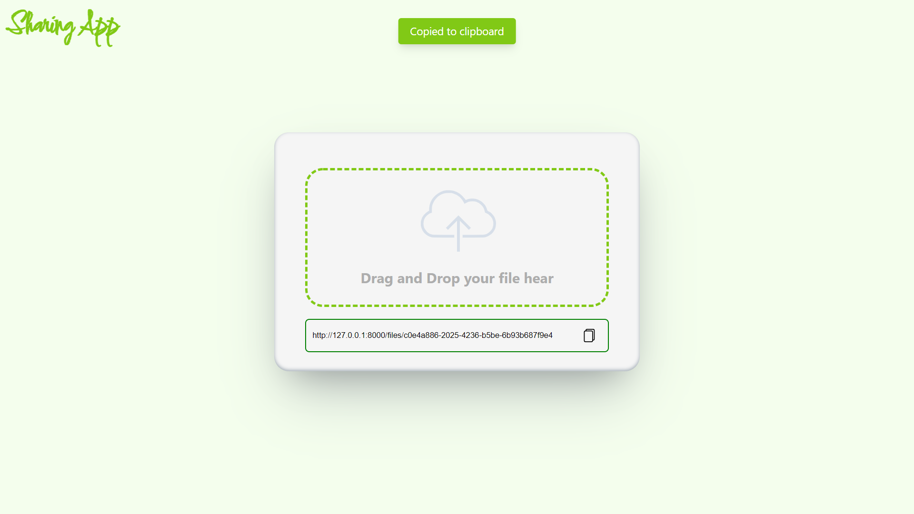
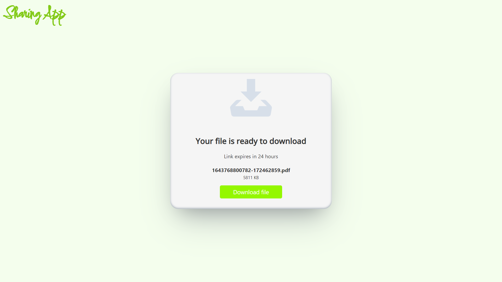

# Sharing App
```
$ huroku login

$ heroku container:login

$ docker build -t registry.heroku.com/share2024/web

$ docker push registry.heroku.com/share2024/web

$ heroku container:relesae web -a share2024

```
## Description 
A file-sharing application that allows you to upload any type of file (.pdf, .png, .jpg, .rar, etc.) and share the download URL (which expires after 24 hours) with your friends

### Stack used
- Nodejs
- express
- MongoDB
- sass
- HTML
- js 
---

## Home page



## Downlode page



----
